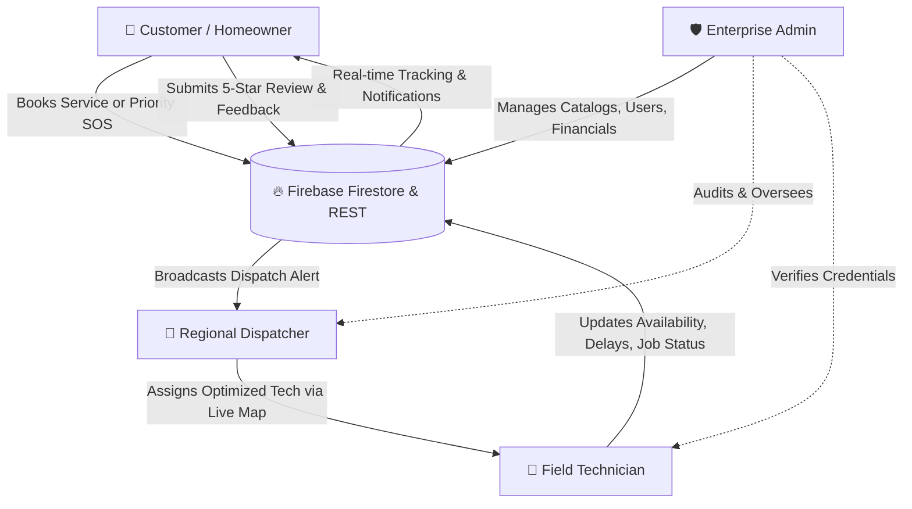

# 🛠️ FixMate — On-Demand Home Services & Dispatch Platform

<p align="center">
  
</p>

<p align="center">
  <strong>A Full-Stack, Real-Time Four-Role Ecosystem for Home Services & Rapid Emergency Dispatch</strong>
</p>

<p align="center">
  
  
  
  
  
  
</p>

---

## 📌 Table of Contents

- [Executive Overview](#-executive-overview)
- [Four-Role Platform Architecture](#-four-role-platform-architecture)
- [Directory & Folder Structure](#-directory--folder-structure)
- [Comprehensive Feature Matrix](#-comprehensive-feature-matrix)
  - [1. Customer Portal](#1-customer-portal-frontendappcustomer)
  - [2. Technician Hub](#2-technician-hub-frontendapptechnician)
  - [3. Dispatcher Terminal](#3-dispatcher-terminal-frontendappdispatcher)
  - [4. Admin Command Center](#4-admin-command-center-frontendappadmin)
  - [5. Public Landing & Marketing Page](#5-public-landing--marketing-page-frontendapp)
- [Backend REST API Specification](#-backend-rest-api-specification)
- [Technology Stack](#-technology-stack)
- [Getting Started & Local Installation](#-getting-started--local-installation)
  - [Prerequisites](#prerequisites)
  - [Backend Setup](#1-backend-setup)
  - [Frontend Setup](#2-frontend-setup)
  - [Environment Configuration](#3-environment-configuration)
- [Role-Based Access Control (RBAC)](#-role-based-access-control-rbac)
- [Design System & UI Highlights](#-design-system--ui-highlights)

---

## 🌟 Executive Overview

**FixMate** is an enterprise-grade, on-demand home service marketplace and emergency maintenance dispatch engine inspired by leading platforms like *Urban Company*. Built with a modern **Next.js 14 App Router** frontend and a **Node.js Express** backend with real-time **Google Firebase Firestore** syncing, FixMate bridges the gap between homeowners requiring trusted home repairs and verified service professionals.

The platform provides an end-to-end lifecycle for maintenance requests—from instant service discovery and priority emergency booking to spatial technician dispatching on live interactive maps, job progress tracking, on-the-fly extra charge adjustments, and customer review auditing.

FixMate is pre-configured with localized Indian pricing (₹) and regional operational logistics (Mangaluru, Karnataka).

---

## 👥 Four-Role Platform Architecture

FixMate's operations revolve around four distinct user personas:



1. **Customer**: Browse multi-category services, place scheduled or emergency bookings, track technician status live, view historical receipts, and provide ratings.
2. **Field Technician**: Manage assigned jobs, toggle availability status, broadcast transit delays or extra material charges, request safety SOS, and track earnings/performance.
3. **Regional Dispatcher**: Central command hub with an interactive live map, algorithmic technician assignment based on proximity and specialty, emergency alert broadcast, and workload balancing.
4. **Enterprise Administrator**: Comprehensive oversight of platform health, user roles, technician certifications, dynamic service catalog & pricing, and financial analytics.

---

## 📂 Directory & Folder Structure

```
FixMate/
├── backend/
│   ├── node_modules/              # Backend dependencies
│   ├── package.json               # Backend dependencies (Express, CORS, Firebase Admin, Dotenv)
│   ├── package-lock.json
│   └── server.js                  # Express REST API, in-memory catalogs, portal data & routes
│
├── frontend/
│   ├── app/                       # Next.js 14 App Router
│   │   ├── admin/
│   │   │   └── page.js            # Enterprise Admin Command Center (Analytics, Users, Services, Bookings)
│   │   ├── customer/
│   │   │   ├── bookings/
│   │   │   │   ├── [id]/
│   │   │   │   │   └── page.js    # Live Booking Details & Real-Time Status Tracking
│   │   │   │   ├── new/
│   │   │   │   │   └── page.js    # New Service Booking Creation Wizard
│   │   │   │   └── page.js        # Customer Bookings History & Management
│   │   │   ├── emergency/
│   │   │   │   └── page.js        # High-Priority SOS Emergency Request Initiation
│   │   │   ├── notifications/
│   │   │   │   └── page.js        # Real-time Notification Center & Status Alerts
│   │   │   ├── profile/
│   │   │   │   └── page.js        # Customer Personal & Address Profile Management
│   │   │   ├── ratings/
│   │   │   │   └── page.js        # 5-Star Rating & Detailed Feedback Submission
│   │   │   ├── services/
│   │   │   │   ├── dashboard/
│   │   │   │   │   └── page.js    # Services Dashboard redirect/entry
│   │   │   │   └── page.js        # Service Directory Navigation
│   │   │   ├── servlist/
│   │   │   │   └── page.js        # Categorized Service Selection Grid
│   │   │   └── page.js            # Customer Main Dashboard
│   │   ├── dispatcher/
│   │   │   └── page.js            # Dispatcher Control Center & Routing Terminal
│   │   ├── technician/
│   │   │   ├── profile/
│   │   │   │   └── page.js        # Technician Profile Setup & Skills Management
│   │   │   └── page.js            # Technician Field Hub & Job Management Console
│   │   ├── globals.css            # Global CSS styles & Tailwind directives
│   │   ├── layout.js              # Root Application Layout & Font Injections
│   │   └── page.js                # Public Marketing Homepage & Gateway
│   │
│   ├── components/                # Modular Reusable React Components
│   │   ├── customer/              # Customer-specific Components
│   │   │   ├── ActiveBookings.js      # Active booking cards with real-time status
│   │   │   ├── BookingForm.js         # Interactive booking inputs & date selection
│   │   │   ├── BookingHistory.js      # Past completed jobs ledger
│   │   │   ├── CustomerFooter.js      # Customer portal footer
│   │   │   ├── CustomerHeader.js      # Customer portal navigation & notifications bell
│   │   │   ├── CustomerProfileForm.js # Profile editing form
│   │   │   ├── EmergencyBanner.js     # Fast SOS booking banner
│   │   │   ├── NotificationBell.js    # Unread count badge & drawer trigger
│   │   │   ├── NotificationWatcher.js # Real-time Firestore notification listener
│   │   │   ├── QuickActions.js        # Quick shortcuts for popular services
│   │   │   ├── ServiceGrid.js         # Service catalog grid cards
│   │   │   └── WelcomeBanner.js       # Customer greeting & active status summary
│   │   │
│   │   ├── dispatcher/            # Dispatcher Terminal Components
│   │   │   ├── AssignTechnicianModal.jsx # Proximity & specialty technician assignment modal
│   │   │   ├── AuditLogsTab.jsx          # Event log & dispatch trail
│   │   │   ├── DashboardTab.jsx          # Dispatcher metrics & urgent broadcasts
│   │   │   ├── DispatcherHeader.jsx      # Status toggle, search bar & navigation
│   │   │   ├── ExpandedMapModal.jsx      # Fullscreen interactive map view
│   │   │   ├── LiveMapTab.jsx            # Geographic technician & job tracking map
│   │   │   ├── NewDispatchModal.jsx      # Manual dispatch creation dialog
│   │   │   ├── ServiceRequestsTab.jsx    # Tabular service requests with CSV export
│   │   │   ├── TechniciansRosterTab.jsx  # Real-time technician availability roster
│   │   │   └── useDispatcherState.js     # Comprehensive dispatcher state hook & handlers
│   │   │
│   │   ├── technician/            # Technician Hub Components
│   │   │   ├── MagicBento.css            # Bento grid styling & animations
│   │   │   ├── MagicBento.jsx            # Modern bento UI showcase for technician stats
│   │   │   ├── StaggeredMenu.css         # Animated menu styles
│   │   │   ├── StaggeredMenu.jsx         # GSAP/CSS staggered navigation menu
│   │   │   ├── TechAuthModal.jsx         # Technician authentication & verification
│   │   │   ├── TechDashboard.jsx         # Overview: today's jobs, earnings, rating
│   │   │   ├── TechDelayModal.jsx        # Traffic / part delay notification broadcaster
│   │   │   ├── TechDesktopSidebar.jsx    # Technician desktop navigation sidebar
│   │   │   ├── TechEmergencyModal.jsx    # Safety SOS & hazard alert broadcast
│   │   │   ├── TechExtraChargesModal.jsx # Spare parts & additional charges dialog
│   │   │   ├── TechHeader.jsx            # Availability toggle (Online/Busy/Offline)
│   │   │   ├── TechJobDetail.jsx         # Step-by-step job execution & status controls
│   │   │   ├── TechJobList.jsx           # Filtered active, pending & completed jobs
│   │   │   ├── TechPerformance.jsx       # Rating score, earnings & review metrics
│   │   │   ├── TechProfile.jsx           # Profile overview, badge & certifications
│   │   │   └── TechnicianProfileForm.jsx # Skill configuration & contact details
│   │   │
│   │   ├── AboutSection.jsx       # About FixMate mission & quality standards
│   │   ├── AuthModal.jsx          # Firebase Login & Signup with Role selection
│   │   ├── BookingModal.jsx       # Quick booking dialog from landing page
│   │   ├── BorderGlow.css         # Modern neon/glow interactive card borders
│   │   ├── BorderGlow.jsx         # Border glow wrapper component
│   │   ├── EmergencyModal.jsx     # Landing page SOS emergency booking modal
│   │   ├── EmergencySection.jsx   # Public emergency response section
│   │   ├── Footer.jsx             # Public page footer with contact details
│   │   ├── Header.jsx             # Public header with auth triggers & navigation
│   │   ├── HeroSection.jsx        # High-impact hero banner with service shortcuts
│   │   ├── HowItWorksSection.jsx  # 3-step workflow (Book, Match, Relax)
│   │   ├── LineSidebar.css        # Sidebar animation styling
│   │   ├── LineSidebar.jsx        # Modern minimalist line navigation sidebar
│   │   ├── MetricsSection.jsx     # Live platform statistics showcase
│   │   ├── PortalModal.jsx        # Role switch preview modal (Urban Company style)
│   │   ├── PortalSection.jsx      # Role ecosystem card preview section
│   │   ├── ProtectedRoute.js      # Client-side route guard enforcing user roles
│   │   ├── ServicesSection.jsx    # Interactive catalog & service card selector
│   │   └── TrustSection.jsx       # Security, verified technicians, warranty badges
│   │
│   ├── data/
│   │   └── services.js            # Comprehensive pre-defined services catalog (7 categories)
│   │
│   ├── lib/
│   │   └── firebase/
│   │       ├── auth.js            # Firebase Auth methods (login, register, logout)
│   │       ├── firebase.js        # Firebase SDK client initialization
│   │       ├── firestore.js       # Firestore CRUD helpers (users collection)
│   │       └── notifications.js   # Notification trigger helpers across booking lifecycle
│   │
│   ├── public/
│   │   └── assets/
│   │       └── images/            # Static image assets (logo, hero images, app mockups)
│   │
│   ├── .env.local                 # Frontend environment variables (Firebase config)
│   ├── next.config.js             # Next.js build configuration
│   ├── package.json               # Frontend dependencies & run scripts
│   ├── postcss.config.js          # PostCSS configuration
│   └── tailwind.config.js         # Custom design tokens, colors & typography
│
├── .gitignore
└── README.md                      # Comprehensive project documentation
```

---

## ⚡ Comprehensive Feature Matrix

### 1. Customer Portal (`frontend/app/customer`)

| Feature | Description | File / Route |
| :--- | :--- | :--- |
| **Personalized Dashboard** | Real-time welcome greeting, quick-access service shortcuts, emergency alerts, active request trackers, and service history. | `app/customer/page.js` |
| **Comprehensive Service Catalog** | 7 main categories: **Electrical**, **Plumbing**, **AC Repair**, **Appliance Repair**, **Carpentry**, **Painting**, and **Cleaning** with transparent pricing in INR (₹) and duration estimates. | `app/customer/servlist/page.js`, `data/services.js` |
| **Interactive Booking Wizard** | Multi-step booking flow with date picker, convenient time slots, detailed issue description, notes, and option to request a previously assigned technician. | `app/customer/bookings/new/page.js` |
| **Live Status Tracking** | Real-time booking detail page displaying current progress: `Pending` ➔ `Assigned` ➔ `Technician On The Way` ➔ `Work Started` ➔ `Completed`. Includes live technician contact and service address. | `app/customer/bookings/[id]/page.js` |
| **Emergency Priority SOS** | Instant priority level 10 dispatching for urgent crises (e.g. pipe bursts, electrical sparking, gas leaks) bypassing standard queues. | `app/customer/emergency/page.js` |
| **In-App Notification Center** | Real-time status update notifications triggered at each milestone of the repair lifecycle with unread badges. | `app/customer/notifications/page.js` |
| **5-Star Rating & Reviews** | Interactive star rating and mandatory feedback system (min. 10 chars) dynamically recalculating the technician's public score. | `app/customer/ratings/page.js` |
| **Customer Profile Management** | Edit personal details, contact mobile number, residential address, and profile data. | `app/customer/profile/page.js` |

---

### 2. Technician Hub (`frontend/app/technician`)

| Feature | Description | File / Route |
| :--- | :--- | :--- |
| **Real-Time Duty Toggle** | Instant availability switch (**Available**, **Busy**, **Offline**) stored locally and synchronized to Firestore and Dispatcher systems. | `components/technician/TechHeader.jsx` |
| **Performance & Metrics Bento** | Modern **Magic Bento Grid** showcasing completed jobs, average customer rating, today's earnings, and job success rate. | `components/technician/TechPerformance.jsx` |
| **Job Execution Pipeline** | Interactive job lifecycle controls: **Accept Booking**, mark **On The Way**, trigger **Start Service**, and finish with **Complete Service**. | `components/technician/TechJobDetail.jsx` |
| **Extra Charges Modal** | On-the-fly billing adjustments for replacement spare parts, materials, or supplemental repair scope. | `components/technician/TechExtraChargesModal.jsx` |
| **Transit & Delay Broadcaster** | One-click delay alerts sent directly to customer and dispatchers (Traffic jams, parts sourcing, previous job extended). | `components/technician/TechDelayModal.jsx` |
| **Safety SOS & Hazard Alert** | Emergency technician backup request modal for on-site safety hazards or structural emergencies. | `components/technician/TechEmergencyModal.jsx` |
| **Profile & Specialization** | Showcase skill tags, years of industry experience, verified certifications, and service zone coverage. | `components/technician/TechProfile.jsx` |
| **Staggered Navigation** | Sleek GSAP-powered floating menu for swift tab transitions between Dashboard, Jobs, Performance, and Profile. | `components/technician/StaggeredMenu.jsx` |

---

### 3. Dispatcher Terminal (`frontend/app/dispatcher`)

| Feature | Description | File / Route |
| :--- | :--- | :--- |
| **Real-Time Control Dashboard** | Metric widgets showing total requests, active field technicians, pending emergencies, and average response times. | `components/dispatcher/DashboardTab.jsx` |
| **Interactive Live Map** | Visual spatial representation of active field technicians and customer request pins across Mangaluru zones (Kodialbail, Hampankatta, Kadri, Bejai, Surathkal). | `components/dispatcher/LiveMapTab.jsx` |
| **Expanded Fullscreen Map** | High-definition enlarged map interface for granular navigation and job allocation. | `components/dispatcher/ExpandedMapModal.jsx` |
| **Smart Technician Assignment** | Modal with automatic recommendations pairing the closest available technician matching the required trade specialty. | `components/dispatcher/AssignTechnicianModal.jsx` |
| **Urgent Dispatch Creation** | Manual dispatch broadcast generator for phone-in bookings or urgent municipality escalations. | `components/dispatcher/NewDispatchModal.jsx` |
| **Requests Ledger & CSV Export** | Filterable requests table with category filter, status filter, pagination, and instant CSV export for reporting. | `components/dispatcher/ServiceRequestsTab.jsx` |
| **Technicians Roster** | Live technician status monitor showing current availability, assigned tickets, and direct contact numbers. | `components/dispatcher/TechniciansRosterTab.jsx` |
| **Audit Activity Log** | Chronological record of assignments, cancellations, and status changes across the regional fleet. | `components/dispatcher/AuditLogsTab.jsx` |

---

### 4. Admin Command Center (`frontend/app/admin`)

| Feature | Description | File / Route |
| :--- | :--- | :--- |
| **Enterprise Analytics Engine** | High-level metrics: Total Registered Users, Total Completed Jobs, Overall Satisfaction Rate (98.6%+), and Monthly Revenue. | `app/admin/page.js` |
| **User Access Management** | Search, filter by role (Customer, Technician, Dispatcher, Admin), activate/suspend accounts, or manually provision new user accounts. | `app/admin/page.js` |
| **Technician Accreditation** | Review field technicians, monitor real-time computed rating averages from customer feedback, and verify specialties. | `app/admin/page.js` |
| **Dynamic Service Catalog Management** | Add new services with custom pricing in INR (₹), assign trade categories, and toggle service availability on or off. | `app/admin/page.js` |
| **Central Booking Oversight** | Master ledger unifying regular customer bookings and high-priority emergency dispatches with search and filter capabilities. | `app/admin/page.js` |
| **Security & Guard Rails** | Enforced role-based protection ensuring only verified `admin` credentials can access governance features. | `components/ProtectedRoute.js` |

---

### 5. Public Landing & Marketing Page (`frontend/app`)

- **High-Impact Hero Section**: Engaging visuals with direct action buttons for immediate service booking.
- **Interactive Service Explorer**: Service category carousels with starting prices and instant booking triggers.
- **How It Works**: 3-step visualization of FixMate's streamlined process (*Book Online ➔ Pro Assigned ➔ Job Done*).
- **Trust & Safety Highlights**: Verified professionals, upfront fixed pricing, and satisfaction guarantee badges.
- **Emergency Service Ribbon**: Prominent 24/7 emergency dispatch callout for urgent household hazards.
- **Four-Role Ecosystem Preview**: Visual cards detailing how FixMate empowers Homeowners, Technicians, Dispatchers, and Admins.
- **Enterprise Console Modal (`PortalModal.jsx`)**: Urban Company-style preview allowing visitors to sample each role's dashboard live.

---

## 🔌 Backend REST API Specification

The Node.js Express backend runs by default on `http://localhost:5000`:

| Method | Endpoint | Description | Sample Request / Payload |
| :--- | :--- | :--- | :--- |
| `GET` | `/api/health` | System health check & timestamp | None |
| `GET` | `/api/services` | Retrieve list of all available service categories & prices | None |
| `GET` | `/api/dispatches` | Fetch active emergency and standard dispatches | None |
| `POST` | `/api/dispatches` | Broadcast an urgent dispatch ticket | `{ "id": "DISP-101", "title": "Pipe Leak", ... }` |
| `DELETE` | `/api/dispatches/:id` | Resolve or remove an active dispatch ticket | URL param `id` |
| `PUT` | `/api/technicians/:id/status` | Update technician status (`Available`, `Busy`, `Offline`) | `{ "status": "Available" }` |
| `POST` | `/api/bookings/status` | Synchronize booking status change across all portals | `{ "jobId": "JOB-1", "status": "In Progress" }` |
| `POST` | `/api/bookings` | Create a new standard booking record | `{ "serviceId": "plumbing", "address": "...", ... }` |
| `POST` | `/api/emergency` | Dispatch an immediate emergency response unit | `{ "emergencyType": "Gas Leak", "phone": "...", "address": "..." }` |
| `GET` | `/api/portals/:role` | Retrieve preview statistics for `customer`, `technician`, `dispatcher`, or `admin` | URL param `role` |

---

## 💻 Technology Stack

### Frontend
- **Framework**: [Next.js 14](https://nextjs.org/) (App Router, Server & Client Components)
- **Library**: [React 18](https://react.dev/)
- **Styling**: [Tailwind CSS 3.4](https://tailwindcss.com/) with customized color palettes
- **Icons**: [Lucide React](https://lucide.dev/)
- **Animations**: [GSAP (GreenSock)](https://greensock.com/) & CSS3 Keyframes
- **WebGL / Graphics**: [OGL](https://github.com/oframe/ogl) (Fluid background effects)

### Backend & Services
- **Runtime**: [Node.js](https://nodejs.org/) (ES Modules)
- **Web Framework**: [Express.js 4](https://expressjs.com/)
- **CORS & Utilities**: `cors`, `dotenv`
- **Database & Auth**: [Google Firebase v10](https://firebase.google.com/)
  - **Firebase Authentication**: Email and password secure login
  - **Cloud Firestore**: Real-time snapshot listeners (`onSnapshot`) for instant cross-portal data synchronization
  - **Firebase Admin SDK**: Server-side privileged operations

---

## 🚀 Getting Started & Local Installation

### Prerequisites
- **Node.js**: v18.0.0 or later installed on your machine ([Download Node.js](https://nodejs.org/))
- **npm** or **yarn** package manager
- A modern web browser (Google Chrome, Edge, Firefox, Brave)

---

### 1. Backend Setup

Open a terminal in the project root directory:

```bash
# Navigate to the backend directory
cd backend

# Install dependencies
npm install

# Start the backend server in development mode (with auto-reload)
npm run dev
```

The backend server will launch at **`http://localhost:5000`**. You can verify it by opening `http://localhost:5000/api/health` in your browser.

---

### 2. Frontend Setup

Open a second terminal in the project root directory:

```bash
# Navigate to the frontend directory
cd frontend

# Install dependencies
npm install

# Start the Next.js development server
npm run dev
```

The frontend application will start at **`http://localhost:3000`**.

---

### 3. Environment Configuration

The frontend comes configured with a `.env.local` file pointing to the Firebase project:

```env
NEXT_PUBLIC_FIREBASE_API_KEY="your-api-key"
NEXT_PUBLIC_FIREBASE_AUTH_DOMAIN="fixmate-99a46.firebaseapp.com"
NEXT_PUBLIC_FIREBASE_PROJECT_ID="fixmate-99a46"
NEXT_PUBLIC_FIREBASE_STORAGE_BUCKET="fixmate-99a46.firebasestorage.app"
NEXT_PUBLIC_FIREBASE_MESSAGING_SENDER_ID="919957587038"
NEXT_PUBLIC_FIREBASE_APP_ID="1:919957587038:web:e1c2e2fb2bc8dea22360cf"
```

> **Note**: For custom Firebase deployments, update the values in `frontend/.env.local` with credentials from your Firebase Console.

---

## 🔒 Role-Based Access Control (RBAC)

FixMate implements client-side and server-side role validation via `ProtectedRoute.js`:

```
          ┌─────────────────┐
          │  Login / Signup │
          └────────┬────────┘
                   │
         ┌─────────┴─────────┐
         ▼                   ▼
   Role: Customer      Role: Technician
         │                   │
   /customer/profile   /technician/profile
         │                   │
   /customer           /technician
```

- **Customer Routes**: Guarded by `allowedRole="customer"` (Redirects unauthorized users to `/`).
- **Technician Routes**: Guarded by `allowedRole="technician"`.
- **Dispatcher Routes**: Guarded by `allowedRole="dispatcher"`.
- **Admin Routes**: Guarded by `allowedRole="admin"`.

*(In development mode, `ProtectedRoute` provides developer bypass capabilities to ease testing and rapid feature verification).*

---

## 🎨 Design System & UI Highlights

FixMate uses a tailored, authoritative color palette defined in `tailwind.config.js`:

| Token | Hex Code | Visual Preview | Usage |
| :--- | :--- | :--- | :--- |
| `prussianBlue` | `#0B2545` |  | Primary Headers, Hero Titles, Brand Anchor |
| `regalNavy` | `#134074` |  | Primary Action Buttons, Badges, Highlights |
| `oxfordNavy` | `#13315C` |  | Secondary Dark Accents, Card Outlines |
| `powderBlue` | `#8DA9C4` |  | Soft Borders, Subtle Icons, Muted Text |
| `mintCream` | `#EEF4ED` |  | Clean Page Backgrounds, Card Highlights |

- **Typography**: `Inter` for crisp body copy and data tables; `Manrope` for bold headings.
- **Glassmorphism & Modals**: Smooth translucent backdrops with subtle border glow animations (`BorderGlow.jsx`).
- **Micro-Interactions**: Hover lifts, smooth spring transitions, and interactive GSAP menus.

---


<p align="center">
  Built for reliable home repairs and rapid emergency dispatches.
</p>
